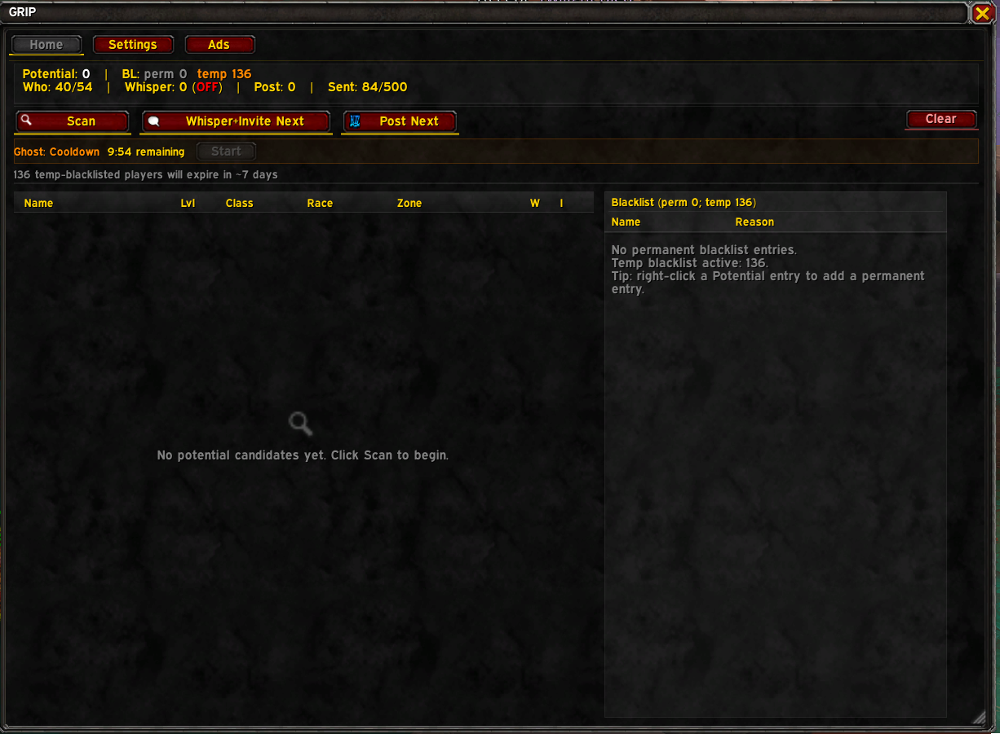
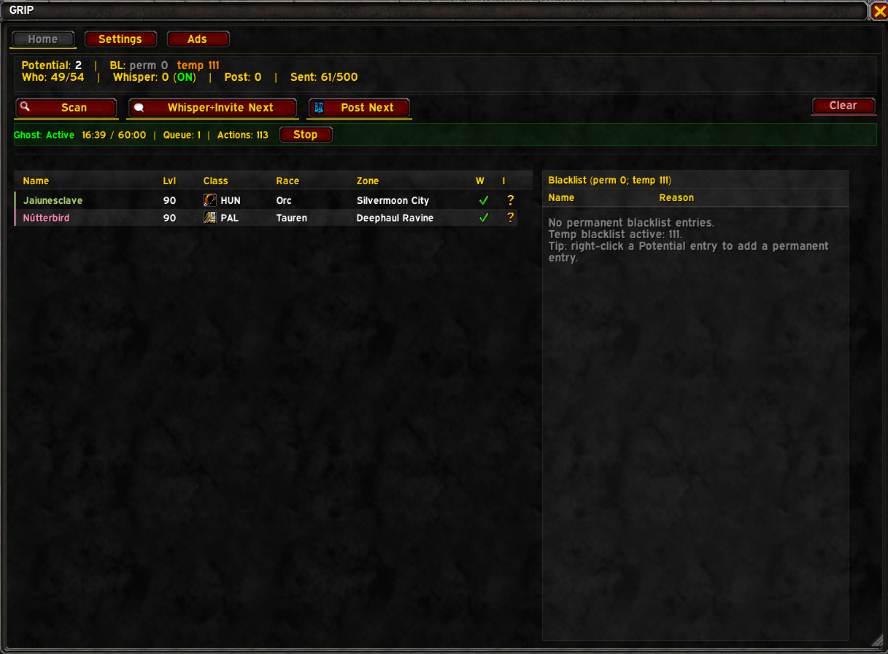
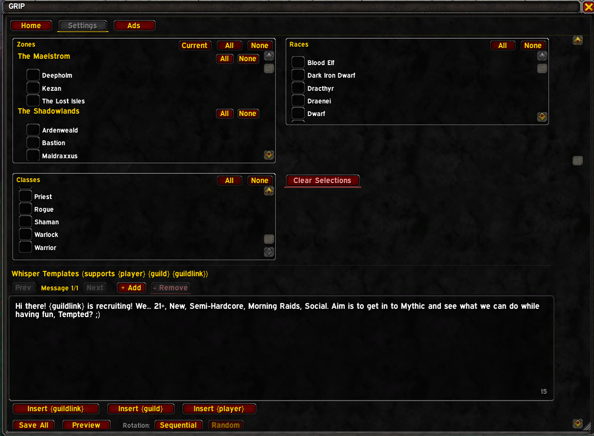
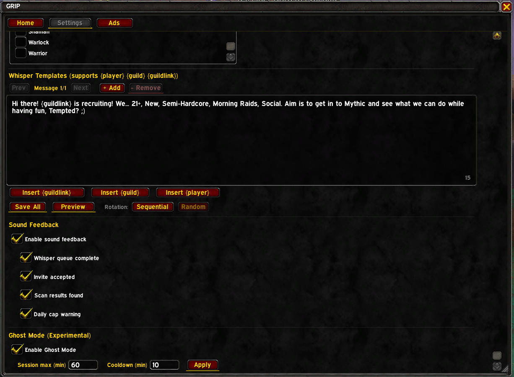
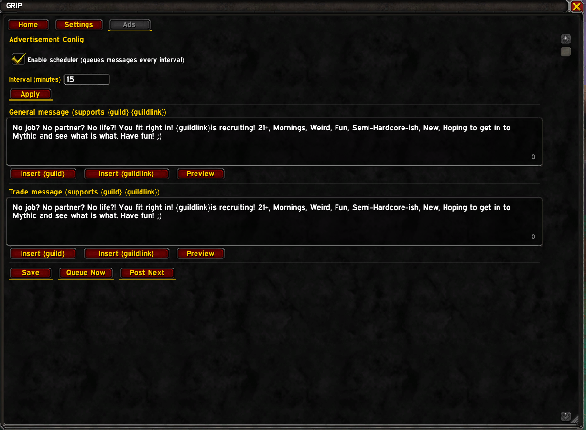

# GRIP – Guild Recruitment Automation

**Target:** Retail / Midnight (12.0.1+)
**Interface:** 120001
**Version:** 1.3.0

[](https://discord.gg/temptingus)

---

## Screenshots

| Home | Ghost Mode Active |
|:---:|:---:|
|  |  |

| Settings | Settings (cont.) | Ads |
|:---:|:---:|:---:|
|  |  |  |

---

## Features

- `/who` scanning for unguilded characters with auto-expanding saturated brackets
- Whisper queue with rate limiting, multiple templates, and sequential/random rotation
- Guild invites (hardware-event gated, one per click/keybind)
- Trade/General post scheduling (hardware-event gated)
- Temp + permanent blacklisting with configurable duration
- Account-wide blacklist shared across all characters
- Raider.IO integration — optionally filter candidates by M+ score when the Raider.IO addon is installed (fail-open: works fine without it)
- Officer blacklist sync — guild officers running GRIP automatically share permanent blacklist entries via addon communication (set-union merge, never removes entries)
- Daily whisper cap (default 500/day) with 80% warning
- Opt-out response detection (auto-blacklists "no thanks" etc.) with optional aggressive tier for profanity-based rejections
- Sound feedback for key events (queue done, invite accepted, cap warning)
- Expansion-grouped zone filter with dynamic discovery and seasonal detection
- Campaign cooldown — session fatigue protection with soft warning + hard auto-pause
- Minimap button + addon compartment support with right-click dropdown
- Ghost Mode (experimental) — full pipeline automation via invisible overlay frame with combat pause, session limits, and persistent cooldown
- Invite-first mode — send guild invite before whispering to reduce Silence risk
- Multilingual opt-out detection (EN/FR/DE/ES) with word-boundary-aware matching
- Recruitment statistics — 30-day rolling daily stats, hourly bucketing, accept rate, and peak hour analysis
- First-run onboarding guide for new users

---

## Blizzard Restrictions (Important)

Some actions require a **hardware event** (mouse click or key press).
GRIP **cannot fully automate** the following:

- `/who` queries — `C_FriendList.SendWho()` (hardware event)
- Guild invites — `C_GuildInfo.Invite()` (hardware event)
- Channel posts — `C_ChatInfo.SendChatMessage(..., "CHANNEL")` (hardware event)

GRIP queues and organizes these actions and provides buttons/keybinds so you can trigger them safely and compliantly.

---

## Install

**CurseForge / Wago / WoWInterface** — search for "GRIP" or install via your addon manager.

**Manual install:**

1. Download the latest release from [GitHub Releases](https://github.com/JesperLive/GRIP/releases).
2. Extract the `GRIP` folder into:

   `World of Warcraft/_retail_/Interface/AddOns/GRIP/`

3. Restart WoW or run `/reload`.

---

## Quick Start

1. Type `/grip` to open the UI
   (or click the **minimap button**).

### Home
- **Scan** — Sends the next `/who` query (locks for configured minimum interval)
- **Whisper+Invite** — Starts whisper queue and sends **one invite**
- **Post Next** — Sends the next queued recruitment ad
- Daily cap status is shown on the Home page

### Settings
- Adjust level range for `/who` scans
- Configure zone/race/class filters (zones grouped by expansion)
- Edit whisper templates (multiple templates with rotation)
- Toggle sound feedback for individual events
- Raider.IO minimum score filter (when RIO addon installed)
- Ghost Mode enable + session/cooldown sliders

### Ads
- Configure General and Trade messages
- Set post interval (scheduler queues messages only)
- Use **Post Next** to actually send

### Stats
- Today / 7-day / 30-day recruitment summaries
- Accept rate and peak activity hours

---

## Minimap Button

- **Left-click** — Toggle GRIP window (Home)
- **Middle-click** — Open Settings
- **Right-click** — Open Ads
- **Drag** — Move around minimap
- Hide/show: `/grip minimap on|off|toggle`

---

## Keybindings

Available under **Key Bindings > AddOns > GRIP**:

- Toggle GRIP window
- Send next `/who` scan
- Send next guild invite
- Send next Trade/General post

Keybindings satisfy hardware-event requirements for restricted actions.

---

## Slash Commands

```
/grip                — toggle UI
/grip help           — show help
/grip build          — rebuild /who queue
/grip scan           — send next /who (hardware event)
/grip whisper        — start/stop whisper queue
/grip invite         — whisper+invite next candidate (hardware event)
/grip post           — send next queued post (hardware event)
/grip clear          — clear Potential list
/grip status         — print counts
/grip stats [7d|30d]     — print recruitment stats summary
/grip stats reset        — clear stats history
/grip link           — show guild name + Guild Finder link resolution
/grip reset          — reset UI window position and size

/grip minimap on|off|toggle

/grip permbl list|add|remove|clear

/grip set levels <min> <max> [step]
/grip set whisper <message>
/grip set general <message>
/grip set trade <message>
/grip set blacklistdays <n>
/grip set interval <minutes>
/grip set dailycap <n>
/grip set sound on|off
/grip set zoneonly on|off
/grip set hidewhispers on|off
/grip set ghostmode on|off
/grip set cooldown <min>|on|off
/grip set invitefirst on|off
/grip set aggressive on|off
/grip set riominscore <n>
/grip set riocolumn on|off

/grip templates list
/grip templates add <message>
/grip templates remove <n>
/grip templates rotation seq|random

/grip ghost start|stop|status

/grip sync on|off|now

/grip debug on|off
/grip debug dump [n]
/grip debug clear
/grip debug copy [n]
/grip debug capture on|off [max]
/grip debug status

/grip zones diag|reseed|deep|export
/grip tracegate on|off|toggle
```

---

## Support

Join our Discord for help, feedback, or feature requests:

**[discord.gg/temptingus](https://discord.gg/temptingus)**

---

## Important Notes

- **Silence penalties:** If players report your whispers as spam, Blizzard may
  apply a Silence penalty to your account. Use conservative intervals and
  personalized messages to minimize risk.
- **Guild Finder listing:** The `{guildlink}` template token only works if your
  guild has an active listing in the Guild Finder. Without one, GRIP falls back
  to your guild name.
- **Opt-out detection:** GRIP automatically detects rejection replies ("no thanks",
  "stop", etc.) in English, French, German, and Spanish and blacklists those players.
  Configure active languages in Settings.
- **Raider.IO:** The M+ score filter requires the Raider.IO addon to be installed
  separately. Without it, the filter is simply skipped.
- **Officer sync:** Blacklist sync requires at least two guild officers running GRIP.
  Uses the GUILD addon channel — no external servers.
- **Not affiliated with Blizzard:** GRIP is a third-party addon. Use at your
  own discretion.

---

## Technical Notes

- `/who` results are server-throttled; GRIP enforces a minimum delay between scans.
- Whispers are not hardware-restricted but are server rate-limited.
- Instance/battleground/scenario characters are excluded by default.
- Blacklist entries expire automatically based on configuration.
- Blacklists and no-response counters are account-wide (shared across all characters). Config, potential list, and filters are per-character.
- Ghost Mode is experimental and disabled by default. Enable in Settings, then `/grip ghost start`.
- Officer blacklist sync uses AceComm + LibSerialize + LibDeflate over the GUILD addon channel. Set-union merge only (entries are added, never removed). Sync failures are pcall-wrapped and cannot break core functionality.
